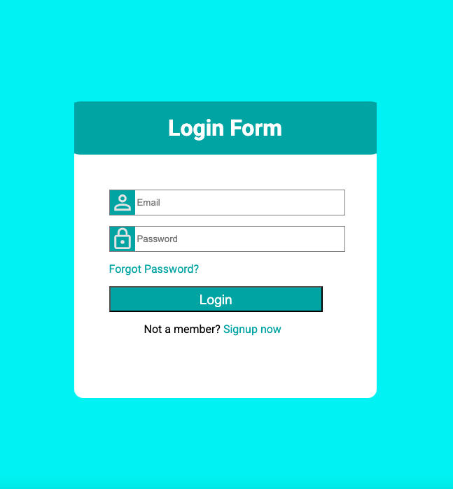

# Login Page

### Since login pages are a common type of website that Web Developers need to make I wanted to try and make on by myself so that I could learn all the skills needed to make one.

### This website is pretty simple, I just added a main section in the center of the page that includes all of the login details. Including username, password, forgot password link, login button, and sign-up link.

